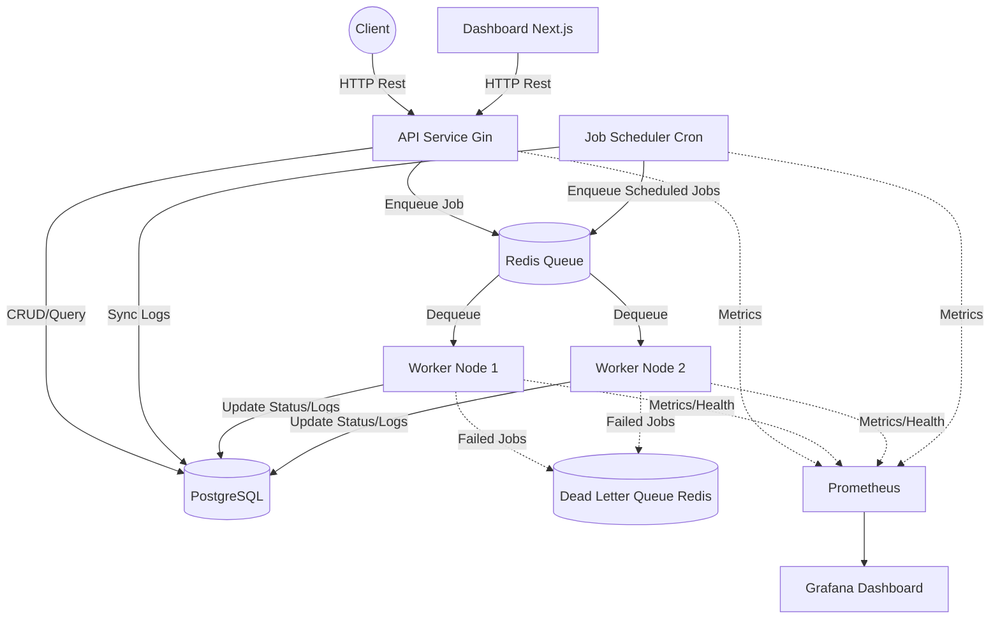

# Distributed Job Platform

A complete production-grade distributed job processing platform similar to Temporal, Celery, or Sidekiq. Built with Go (Gin), Next.js, PostgreSQL, and Redis.

## Architecture

## Repository Structure

- `apps/api`: REST API for job submission and status tracking
- `apps/dashboard`: Next.js Web UI
- `services/worker`: Job processing engine
- `services/scheduler`: Cron job scheduling
- `packages/*`: Shared database, config, logger, and queue abstractions
- `infra/*`: Docker and observability configurations

## Tech Stack

- **Backend**: Go (Gin)
- **Frontend**: Next.js + TypeScript
- **Database**: PostgreSQL (GORM)
- **Message Broker/Queue**: Redis
- **Infra**: Docker Compose
- **Monitoring**: Prometheus + Grafana

## License
MIT
